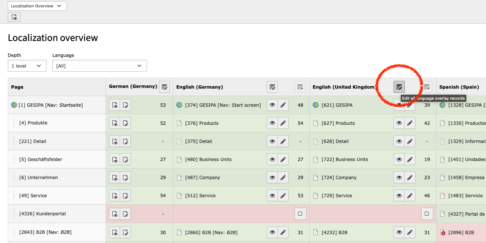
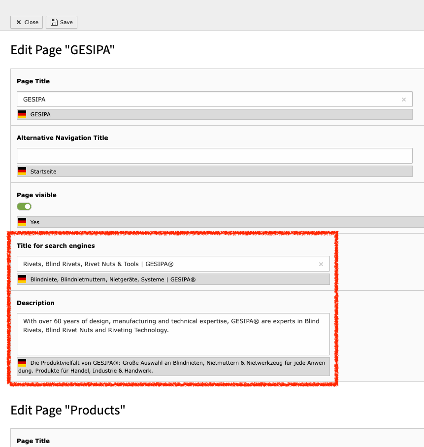
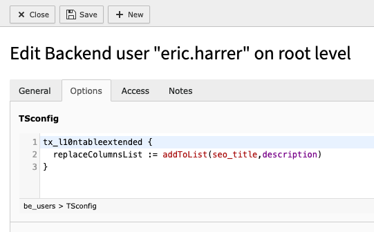
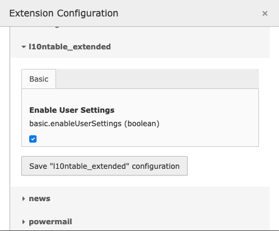
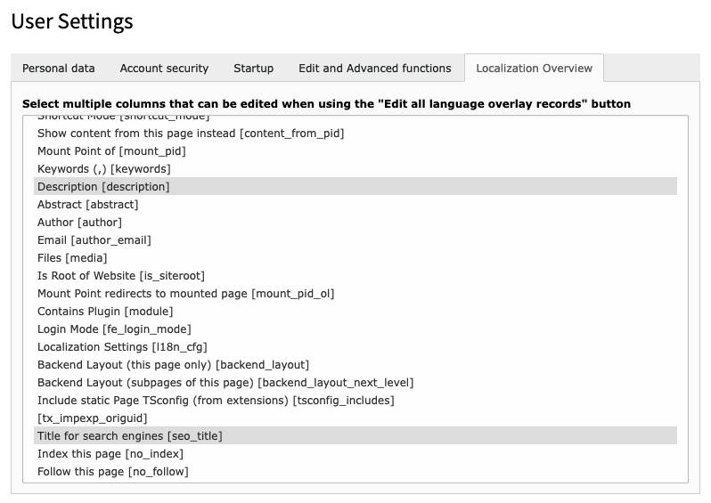

# Extended Localization Table

Experimental TYPO3 Extension by Eric Harrer

## Description

With the assistance of this extension, the **Localization Overview** within the **Info** module gains an enhanced `Edit all language overlay records` button, featuring individually customizable fields.



This empowers users to conveniently perform batch edits on configurable page fields on page translations. By default, only the `title`, `nav_title` and `hidden` fields are available for batch processing in the translation view. This can now be extended to any (existing) page fields.



## Installation

Install the extension via Composer using

```
composer req erhaweb/l10ntable-extended
```

## How to use

### Global configuration via user TSconfig

After the installation the following can be defined in the `User TSconfig` to define as administrator for backend user groups or single backend users which columns they can edit:

```
tx_l10ntableextended {
  replaceColumnsList := addToList(seo_title,description)
}
```



In this example, the two fields `seo_title` and `description` would be added to the standard field list `title,nav_title,hidden`.

Of course, it is also possible to omit all or some of the fields that are used by default and use only your own fields. In this case overwrite the default list via a simple `=` statement.

```
tx_l10ntableextended {
  columns = seo_title,description
}
```

Fields that are not available in the context of a page type (for example, the `seo_title` field for pages of type `Folder [254]`) are simply not displayed in the context of batch editing.

Fields that do not exist in `$GLOBALS['TCA']['pages']['columns']` are **not considered at all**.

### Extension Configuration

Under Admin Tools > Settings > Extension Configuration you can determine whether non-admin backend users can also determine the list of editable fields within their User Settings. Set the option for this:

```
enableUserSettings = 1
```



### Configuration via the backend user settings

If the User Settings have been activated in the Extension Configuration, all backend users (also non-admin users) can determine the page fields that should be editable via a multiple selection field.



## Attention

Please do not expect too much from this extension. It is based on a simple string replacement in the final output of the function `TranslationStatusController::renderL10nTable`.

The disadvantage is that the functionality of this extension is broken if something of the output of the method changes in the future. After all, the output at the required position remained identical in both TYPO3 v11 and v12.

The advantage with this approach is that despite the use of XCLASS no problems with the core behavior can arise.

## Tipp

If the default fields used by the TYPO3 core for batch editing in future versions have indeed changed and this extension no longer works, try updating the following default `User TSconfig` setting to match the new field list:

```
tx_l10ntableextended {
  searchColumnsList = title,nav_title,l18n_cfg,hidden|title,nav_title,hidden
}
```
The pipe symbol `|` allows you to define several possible search column lists that are to be replaced by `tx_l10ntableextended.replaceColumnsList` in the final HTML output.  In this way, it is possible to manipulate both the button of the default language and the button of the non-default languages and thus make changes to individually definable fields in all available languages.

Even the name of the `columnsOnly` parameter that is evaluated by the `EditDocumentController` could be customized using the following setting.

```
tx_l10ntableextended {
  columnsUrlParameter = columnsOnly
}
```

However, this should normally not be necessary.
